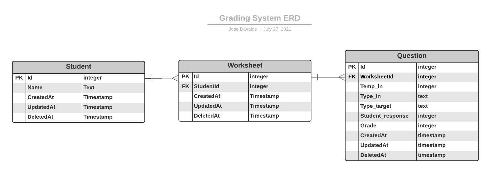
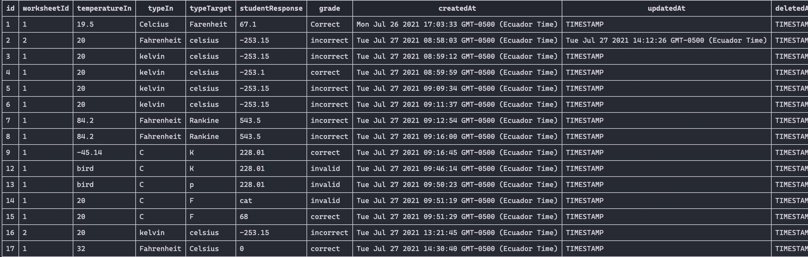

# Grading-API

## Table of contents

- [Prerequisites](#prerequisites)
- [Install](#install)
- [Run the app](#run-the-app)
- [Entity Relationship Diagram](#entity-relationship-diagram-erd)
- [Example Usage](#example-usage)
- [REST API](#rest-api)
  - [Students](#get-all-students)
  - [Worksheets](#get-all-worksheets)
  - [Questions](#get-all-questions-stored)
  
## Prerequisites

- Node v14.15.5
- Npm v6.14.11

## Install

1. Clone repo: `git clone https://github.com/josedavalos96/Grading-API.git`
2. Run: `npm install`

## Run the app

1. Run: `node src/index`
2. The app will be listening for requests on localhost port 3000

## Entity Relationship Diagram (ERD)

The database uses three tables representing students, worksheets and questions. The figure below show their relationship and properties:

Figure 1: Database ERD

## Example Usage

The following example show the input of a question into a worksheet. The question asked the student to convert 32F to Celcius.

### Request

    POST http://localhost:3000/v1/question/1

### Body

    {
        "worksheetId": 2,
        "temperatureIn": 32,
        "typeIn": "Fahrenheit",
        "typeTarget": "Celsius",
        "studentResponse": "0"
    }

### Response

    {
        "message": "success",
        "id": 17
    }

### Record stored in DB

Last POST request inserted data in the Database and showed the id of the last record created. Looking at record `17` in table _`question`_ we can see that the record created succesfully and graded the student answer.

Figure 2: Database question table snapshot

## REST API

## Get all Students

### Request

`GET /v1/students/`

    http://localhost:3000/v1/students/

### Response

    {
        "message": "success",
        "data": [
            {
                "id": 1,
                "name": "Daniel",
                "createdAt": "Mon Jul 26 2021 17:03:33 GMT-0500 (Ecuador Time)",
                "updatedAt": "TIMESTAMP",
                "deletedAt": "TIMESTAMP"
            },
            {
                "id": 3,
                "name": "Jose",
                "createdAt": "Mon Jul 26 2021 17:03:33 GMT-0500 (Ecuador Time)",
                "updatedAt": "TIMESTAMP",
                "deletedAt": "TIMESTAMP"
            }
        ]
    }

## Get a single student by Id

### Request

`GET /v1/students/:id/`

    http://localhost:3000/v1/students/1

### Response

    {
        "message": "success",
        "data": {
            "id": 1,
            "name": "Daniel",
            "createdAt": "Mon Jul 26 2021 17:03:33 GMT-0500 (Ecuador Time)",
            "updatedAt": "TIMESTAMP",
            "deletedAt": "TIMESTAMP"
        }
    }

## Create a new Student record

### Request

`POST /v1/students/`

    http://localhost:3000/v1/students/

### Body

    {
        "name": "New User"
    }

### Response

    {
        "message": "success",
        "id": 4
    }

## Edit a Student record

### Request

`PATCH /v1/students/:id`

    http://localhost:3000/v1/students/4

### Body

    {
        "name": "New Edit"
    }

### Response

    {
    "message": "success",
    "changes": 1
    }

## Delete a Student record

## Request

`DELETE /v1/students/:id`

    http://localhost:3000/v1/students/4

## Response

    {
    "message": "deleted",
    "changes": 1
    }

## Get All Worksheets

## Request

`GET /v1/worksheet/`

    http://localhost:3000/v1/worksheet/

## Response

    {
        "message": "success",
        "data": [
            {
                "id": 1,
                "studentId": 1,
                "createdAt": "Mon Jul 26 2021 17:03:33 GMT-0500 (Ecuador Time)",
                "updatedAt": "TIMESTAMP",
                "deletedAt": "TIMESTAMP"
            },
            {
                "id": 2,
                "studentId": 2,
                "createdAt": "Mon Jul 26 2021 17:03:33 GMT-0500 (Ecuador Time)",
                "updatedAt": "TIMESTAMP",
                "deletedAt": "TIMESTAMP"
            },
            {
                "id": 3,
                "studentId": 3,
                "createdAt": "Mon Jul 26 2021 17:03:33 GMT-0500 (Ecuador Time)",
                "updatedAt": "TIMESTAMP",
                "deletedAt": "TIMESTAMP"
            }
        ]
    }

## Get all worksheets from a Student

### Request

`GET /v1/worksheet/:studentId`

    http://localhost:3000/v1/worksheet/1

### Response

    {
        "message": "success",
        "data": [
            {
                "id": 1,
                "studentId": 1,
                "createdAt": "Mon Jul 26 2021 17:03:33 GMT-0500 (Ecuador Time)",
                "updatedAt": "TIMESTAMP",
                "deletedAt": "TIMESTAMP"
            }
        ]
    }

## Create a students' worksheet

### Request

`POST /v1/worksheet/:studentId`

    http://localhost:3000/v1/worksheet/2

### Response

    {
        "message": "success",
        "id": 4
    }

## Edit the worksheet and assign it to other student

### Request

`PATCH /v1/worksheet/:worksheetId`

    http://localhost:3000/v1/worksheet/2

### Body

    {
        "studentId": 3
    }

### Response

    {
        "message": "success",
        "changes": 1
    }

## Delete a worksheet

### Request

`DELETE /v1/worksheet/:worksheetId`

    http://localhost:3000/v1/worksheet/4

### Response

    {
        "message": "deleted",
        "changes": 1
    }

## Get all questions stored

### Request

`GET /v1/question/`

    http://localhost:3000/v1/question/

### Response

    {
    "message": "success",
    "data": 
        [
            {
                "id": 1,
                "worksheetId": 1,
                "temperatureIn": 19.5,
                "typeIn": "Celcius",
                "typeTarget": "Farenheit",
                "studentResponse": 67.1,
                "grade": "Correct",
                "createdAt": "Mon Jul 26 2021 17:03:33 GMT-0500 (Ecuador Time)",
                "updatedAt": "TIMESTAMP",
                "deletedAt": "TIMESTAMP"
            },
            {
                "id": 2,
                "worksheetId": 1,
                "temperatureIn": 20,
                "typeIn": "kelvin",
                "typeTarget": "celsius",
                "studentResponse": "50",
                "grade": "incorrect",
                "createdAt": "Tue Jul 27 2021 08:58:03 GMT-0500 (Ecuador Time)",
                "updatedAt": "TIMESTAMP",
                "deletedAt": "TIMESTAMP"
            },
            {
                "id": 3,
                "worksheetId": 1,
                "temperatureIn": 20,
                "typeIn": "kelvin",
                "typeTarget": "celsius",
                "studentResponse": "-253.15",
                "grade": "incorrect",
                "createdAt": "Tue Jul 27 2021 08:59:12 GMT-0500 (Ecuador Time)",
                "updatedAt": "TIMESTAMP",
                "deletedAt": "TIMESTAMP"
            },
            ...
        ]
    }

## Get Questions from a worksheet

### Request

`GET /v1/question/1`

    http://localhost:3000/v1/question/1

### Response

    {
        "message": "success",
        "data": 
        [
            {
                "id": 1,
                "worksheetId": 1,
                "temperatureIn": 19.5,
                "typeIn": "Celcius",
                "typeTarget": "Farenheit",
                "studentResponse": 67.1,
                "grade": "Correct",
                "createdAt": "Mon Jul 26 2021 17:03:33 GMT-0500 (Ecuador Time)",
                "updatedAt": "TIMESTAMP",
                "deletedAt": "TIMESTAMP"
            },
            {
                "id": 2,
                "worksheetId": 1,
                "temperatureIn": 20,
                "typeIn": "kelvin",
                "typeTarget": "celsius",
                "studentResponse": "50",
                "grade": "incorrect",
                "createdAt": "Tue Jul 27 2021 08:58:03 GMT-0500 (Ecuador Time)",
                "updatedAt": "TIMESTAMP",
                "deletedAt": "TIMESTAMP"
            },
            {
                "id": 3,
                "worksheetId": 1,
                "temperatureIn": 20,
                "typeIn": "kelvin",
                "typeTarget": "celsius",
                "studentResponse": "-253.15",
                "grade": "incorrect",
                "createdAt": "Tue Jul 27 2021 08:59:12 GMT-0500 (Ecuador Time)",
                "updatedAt": "TIMESTAMP",
                "deletedAt": "TIMESTAMP"
            },
            ...
        ]
    }

## Create a new Question Record

### Request

`POST /v1/question/:worksheetId`

    http://localhost:3000/v1/question/2

### Body

    {
        "worksheetId": 2,
        "temperatureIn": 20,
        "typeIn": "kelvin",
        "typeTarget": "celsius",
        "studentResponse": "-253.15"
    }

### Response

    {
        "message": "success",
        "id": 16
    }

## Edit a question record

### Request

`PATCH /v1/question/:questionId`

    http://localhost:3000/v1/question/2

### Body

    {
        "worksheetId": 2,
        "temperatureIn": 20,
        "typeIn": "Fahrenheit",
        "typeTarget": "celsius",
        "studentResponse": "-253.15"
    }

### Response

    {
        "message": "success",
        "changes": 1
    }

## Delete Question

### Request

`DELETE /v1/question/:questionId`

    http://localhost:3000/v1/question/11

### Response

    {
        "message": "deleted",
        "changes": 1
    }
